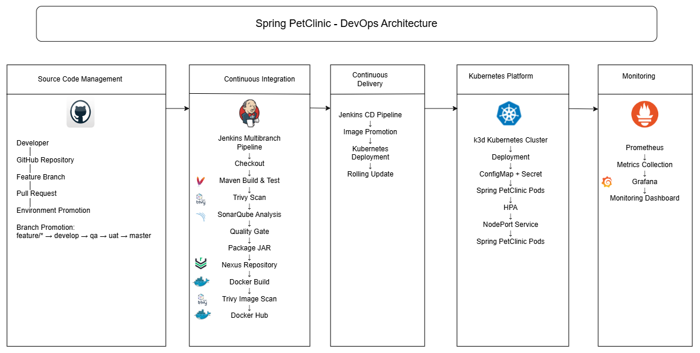
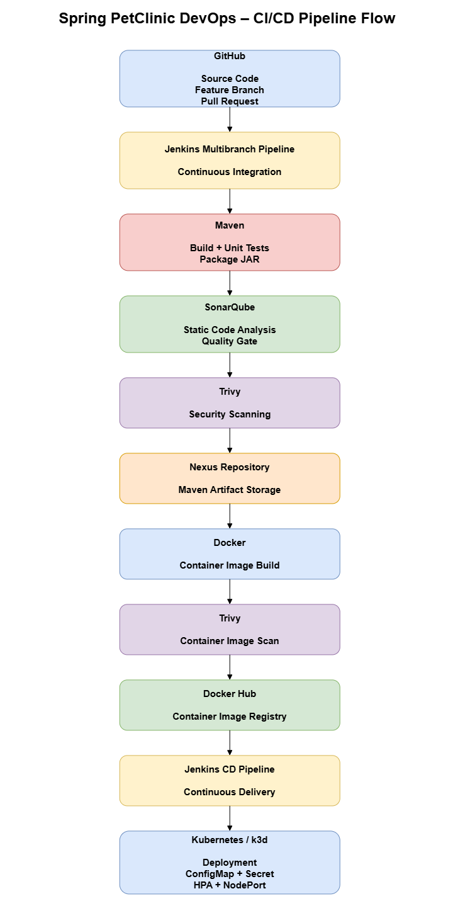
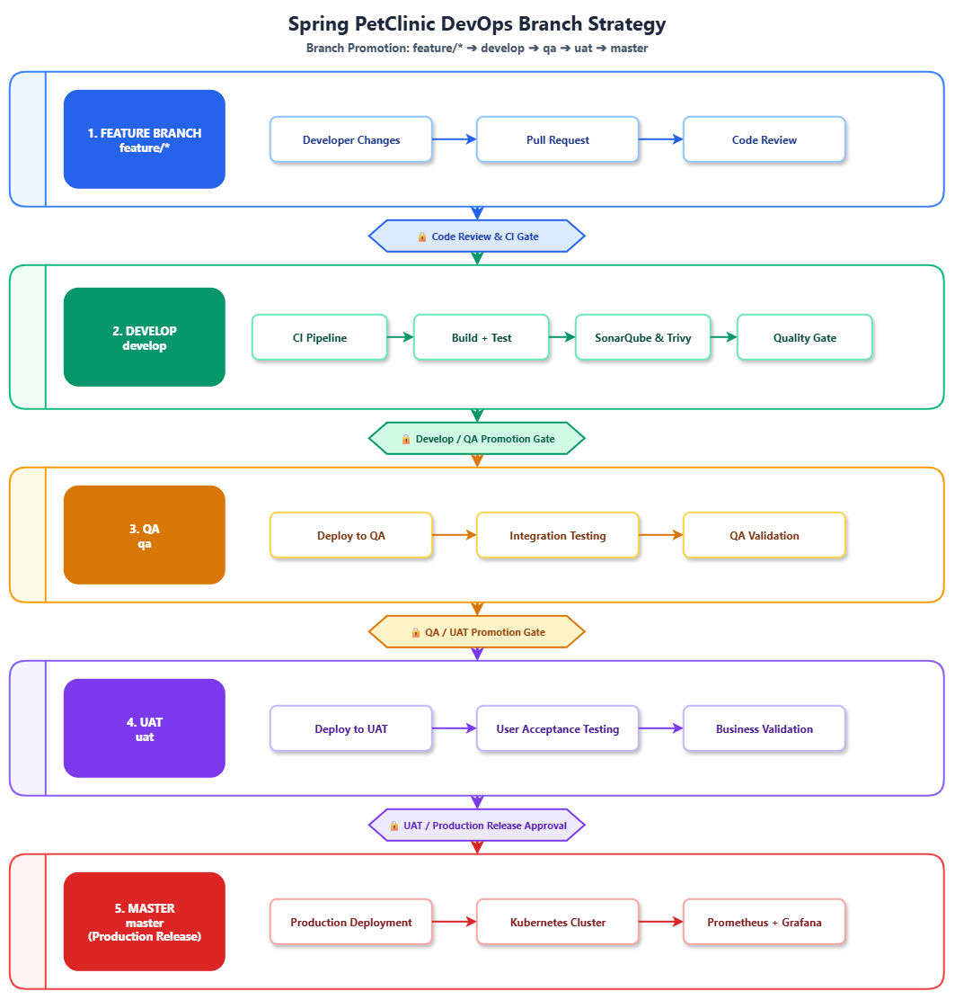

# Project Documentation

This directory contains documentation for the Spring PetClinic DevOps implementation.

## Documentation Structure

```text
docs/
├── architecture/
│   ├── architecture.mmd
│   ├── branch-strategy.drawio
│   └── cicd-flow.drawio
│
├── images/
│   ├── spring-petclinic-devops-architecture.png
│   ├── cicd-flow.png
│   └── branch-strategy.png
│
├── spring-petclinic-devops-architecture.drawio
│
└── README.md
```

## Architecture

### Spring PetClinic DevOps Architecture

The architecture diagram represents the end-to-end DevOps implementation covering source control, continuous integration, security scanning, artifact management, containerization, continuous delivery, Kubernetes deployment, and monitoring.



[View editable architecture diagram](spring-petclinic-devops-architecture.drawio)

### CI/CD Pipeline Flow

The CI/CD pipeline flow illustrates how source code moves from GitHub through Jenkins CI, Maven, SonarQube, Trivy, Nexus, Docker, Docker Hub, Jenkins CD, and Kubernetes.



[View editable CI/CD flow diagram](architecture/cicd-flow.drawio)

### Branch Strategy

The branch strategy illustrates how changes are promoted through the development lifecycle from feature branches to the master production branch, with code review, CI, QA, UAT, and production release gates.



[View editable branch strategy diagram](architecture/branch-strategy.drawio)

## DevOps Components

| Component | Purpose |
|---|---|
| GitHub | Source code management and branch-based development |
| Jenkins | Continuous Integration and Continuous Delivery |
| Maven | Application build and test automation |
| SonarQube | Static code analysis and Quality Gate |
| Trivy | Container image security scanning |
| Nexus Repository | Artifact repository |
| Docker | Container image creation |
| Docker Hub | Container image registry |
| Kubernetes / k3d | Application deployment and orchestration |
| ConfigMap | Kubernetes application configuration |
| Secret | Kubernetes sensitive configuration |
| HPA | Kubernetes horizontal pod autoscaling |
| NodePort | Application service exposure |
| Prometheus | Metrics collection |
| Grafana | Monitoring and visualization |

## Documentation

The documentation in this directory contains the architecture diagrams and supporting DevOps implementation documentation.

---

Editable diagrams are maintained in `.drawio` format and exported as PNG images for documentation.

### Implementation Documentation

- [Monitoring and Observability](monitoring.md)
- [Security](security.md)

### Infrastructure

AWS infrastructure and Amazon EKS provisioning are maintained separately using Terraform.

The Terraform repository provisions the AWS infrastructure required for the DevOps environment, including:

- VPC with public and private subnets
- Internet Gateway and NAT Gateway
- Amazon EKS cluster and managed node group
- IAM roles and policies
- EC2 instance

**Terraform infrastructure repository:** [Terraform](https://github.com/sssandeep9999/Terraform)
